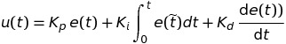

# Project 7 - PID Controller

This project from Udacity‘s Self-Driving Car Engineer Nanodegree program implements a basic PID controller in C++ for self-driving cars. The project covers the implementation of the PID controller, parameter tuning with Fiddle and testing in a simulator.

---

## 1 - Project Overview

### Goals:

* implement a PID controller
* tune parameters of the PID controller (manually or by using an algorithm)
* the car should complete one round and not leave the racing track

### Structure:

The project is divided into different files.

* `src/main.cpp`: the routine with connection to the simulator
* `src/PID.cpp` (and header file): the PID controller and Twiddle algorithm
* other helper, build and installation files

### Dependencies

This project needs following dependencies:

* cmake >= 3.5
* make >= 4.1
* gcc/g++ >= 5.4
* [uWebSockets](https://github.com/uWebSockets/uWebSockets)
  * Run either `install-mac.sh` or `install-ubuntu.sh`.

To display the results the simulator from Udacity is needed. It can be downloaded [here](https://github.com/udacity/self-driving-car-sim/releases). 
To run the simulator on Mac/Linux, first make the binary file executable with the following command:

```shell
sudo chmod u+x {simulator_file_name}
```

### Basic Build Instructions

1. Clone this repo.
2. Make a build directory: `mkdir build && cd build`
3. Compile: `cmake .. && make`
4. Run it: `./pid`.

---

## 2 - Rubic Points

Here I will consider the [rubric points](https://review.udacity.com/#!/rubrics/1972/view) individually and describe how I addressed each point in my implementation.

#### 2.1 - Compilation

**1.) The code compiles correctly.**

I tested the code with the given `CMakeLists.txt` and `cmakepath.txt` files and it compiled with no errors.

### 2.2 - Implementation

**1.) The PID procedure follows what was taught in the lessons.**

The PID controller equation is: 

where u(t) is the output value, e(t) the current error, Kp is the parameter for the proportional part of the controller, Ki is the parameter for the integration part of the controller and Kd is the parameter for the differential part of the controller.

I implemented the PID controller in the `PID.cpp` file in lines 17-25:

```c++
void PID::UpdateError(double cte) {
    d_error = cte - p_error;
    p_error = cte;
    i_error += cte;
}

double PID::evaluate() {
  return -Kp*p_error - Kd*d_error - Ki*i_error;
}
```

The integral is calculated as the sum of all former errors and the differential is simplyfied as the difference from the previous and the current error.

### 2.3 - Reflection

**1.) Describe the effect each of the P, I, D components had in your implementation.**

The basic P controller works propotional to the error. The larger the error becomes, the more the output will be. This results in a bigger steering angle when the car gets off the middle of the lane. The p component has the big problem of overshooting the target as you can see in the following animation: 


The D component adds a differential part to the controller to adress the overshooting problem. This worked well, as you can see in the next animation:


The I component is implemented to deal with biases from the enviroment. Since the simulator seems bias free the I component has a small to not existing impact on the controlling. Though it seems to stabilise the car a little bit:


**2.) Describe how the final hyperparameters were chosen.**

The primary hyperparameters were chosen manually by the "engineers view" by choosing similar values like the one from the lessons. Then I implemented the Twiddle algorithm to find the best values (`P: 0.238943, I: 0.000762649, D: 2.00905`). 

### 2.4 - Simulation

**1.) The vehicle must successfully drive a lap around the track.**

[Here](/videos/full_round.mp4) you can find a video with the car driving a lap.
